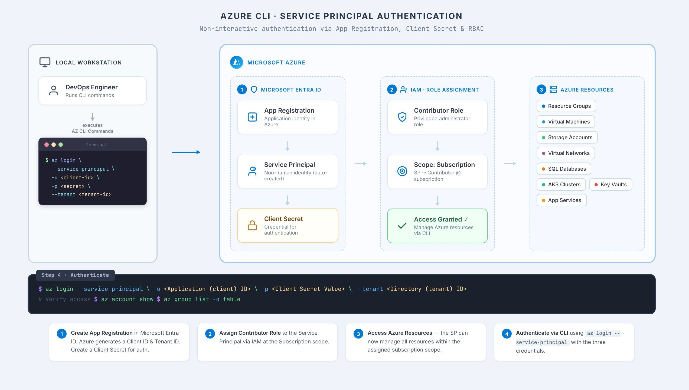
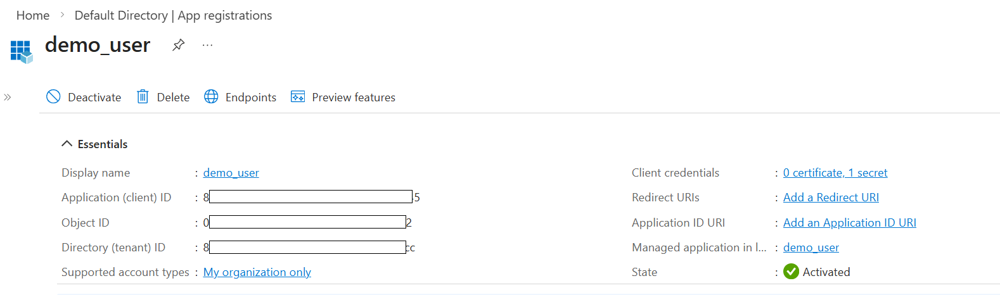
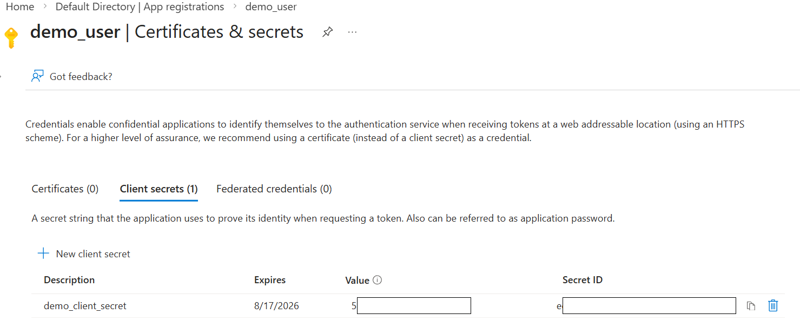
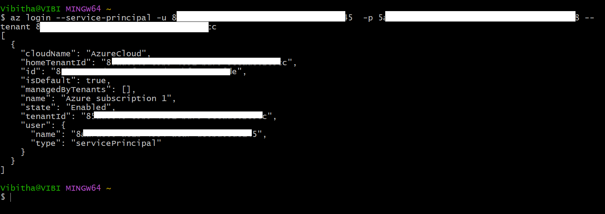

# Service-Principal-Authentication
> Authenticate Azure CLI using a Service Principal

### 📌Overview
This project demonstrates how to authenticate with Azure CLI using a Service Principal, providing a more secure and controlled authentication method ideal for automation and non-interactive environments.

### 🏗️Setup Architecture

### ⚜️Key Features
- Eliminates interactive login for seamless automation.
- Secure credential management using client secrets.
- Suitable for CI/CD pipelines and automation workflows.

### ⚙️How It Works
- **App Registration** —  is created in Microsoft Entra ID which automatically generates a corresponding Service Principal on the Enterprise application.
- **A client secret**  — is created and used as the credential for authentication.
- **Contributor role** — is assigned through IAM for the Service Principal associated with the App Registration on the specific Azure subscription to grant the required permissions.
- **Authenticate Azure CLI** — using the service principal credentials.

### 🪧Demonstration

#### Azure App Registration

#### Client Secret

#### Contributor Role

#### Authentication Successfull

